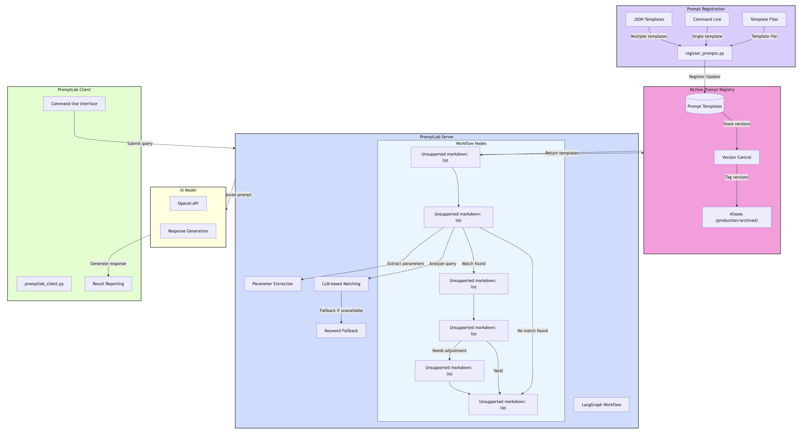

# PromptLab: AI Query Enhancement with MLflow Integration

PromptLab is an intelligent system that transforms basic user queries into optimized prompts for AI systems using MLflow Prompt Registry. It dynamically matches user requests to the most appropriate prompt template and applies it with extracted parameters.

## 🔍 Overview

PromptLab combines MLflow Prompt Registry with dynamic prompt matching to create a powerful, flexible system for prompt engineering:

- **Centralized Prompt Management**: Store, version, and manage prompts in MLflow
- **Dynamic Matching**: Intelligently match user queries to the best prompt template
- **Version Control**: Track prompt history with production and archive aliases
- **Extensible**: Easily add new prompt types without code changes

## 🏗️ Architecture

The system consists of three main components:

1. **Prompt Registry** (`register_prompts.py`) - Tool for registering and managing prompts in MLflow
2. **Server** (`promptlab_server.py`) - Server with dynamic prompt matching and LangGraph workflow
3. **Client** (`promptlab_client.py`) - Lightweight client for processing user queries

### Workflow Process



1. **Prompt Registration**: Register prompt templates in MLflow with versioning and aliasing
2. **Prompt Loading**: Server loads all available prompts from MLflow at startup
3. **Query Submission**: User submits a natural language query via the client
4. **Intelligent Matching**: LLM analyzes the query and selects the most appropriate prompt template
5. **Parameter Extraction**: System extracts required parameters from the query
6. **Template Application**: Selected template is applied with extracted parameters
7. **Validation & Adjustment**: Enhanced prompt is validated and adjusted if needed
8. **Response Generation**: Optimized prompt produces a high-quality response

## 📂 Code Structure

```
promptlab/
├── promptlab_server.py            # Main server with LangGraph workflow
├── promptlab_client.py            # Client for processing queries
├── register_prompts.py            # MLflow prompt management tool
├── requirements.txt               # Project dependencies
├── advanced_prompts.json          # Additional prompt templates
└── README.md                      # Project documentation
```

### Core Components:

#### `register_prompts.py`
- **Purpose**: Manages prompts in MLflow Registry
- **Key Functions**:
  - `register_prompt()`: Register a new prompt or version
  - `update_prompt()`: Update an existing prompt (archives previous production)
  - `list_prompts()`: List all registered prompts
  - `register_from_file()`: Register multiple prompts from JSON
  - `register_sample_prompts()`: Initialize with standard prompts

#### `promptlab_server.py`
- **Purpose**: Processes queries using LangGraph workflow
- **Key Components**:
  - `load_all_prompts()`: Loads prompts from MLflow
  - `match_prompt()`: Matches queries to appropriate templates
  - `enhance_query()`: Applies selected template
  - `validate_query()`: Validates enhanced queries
  - `LangGraph workflow`: Orchestrates the query enhancement process

#### `promptlab_client.py`
- **Purpose**: Provides user interface to the service
- **Key Features**:
  - Process queries with enhanced prompts
  - List available prompts
  - Display detailed prompt matching information

## 🚀 Getting Started

### Prerequisites

- Python 3.12
- Dependencies in `requirements.txt`
- OpenAI API key for LLM capabilities

### Installation

```bash
# Clone the repository
git clone https://github.com/iRahulPandey/PromptLab.git
cd PromptLab

# Install dependencies
pip install -r requirements.txt

# Set environment variables
export OPENAI_API_KEY="your-openai-api-key"
```

### Registering Prompts

Before using PromptLab, you need to register prompts in MLflow:

```bash
# Register sample prompts (essay, email, technical, creative)
python register_prompts.py register-samples

# Register additional prompt types (recommended)
python register_prompts.py register-file --file advanced_prompts.json

# Verify registered prompts
python register_prompts.py list
```

### Running the Server

```bash
# Start the server
python promptlab_server.py
```

### Using the Client

```bash
# Process a query
python promptlab_client.py "Write a blog post about machine learning"

# List available prompts
python promptlab_client.py --list

# Enable verbose output
python promptlab_client.py --verbose "Create a presentation on climate change"
```

## 📋 Prompt Management

### Available Prompt Types

PromptLab supports a wide range of prompt types:

| Prompt Type | Description | Example Use Case |
|------------|-------------|-----------------|
| essay_prompt | Academic writing | Research papers, analyses |
| email_prompt | Email composition | Professional communications |
| technical_prompt | Technical explanations | Concepts, technologies |
| creative_prompt | Creative writing | Stories, poems, fiction |
| code_prompt | Code generation | Functions, algorithms |
| summary_prompt | Content summarization | Articles, documents |
| analysis_prompt | Critical analysis | Data, texts, concepts |
| qa_prompt | Question answering | Context-based answers |
| social_media_prompt | Social media content | Platform-specific posts |
| blog_prompt | Blog article writing | Online articles |
| report_prompt | Formal reports | Business, technical reports |
| letter_prompt | Formal letters | Cover, recommendation letters |
| presentation_prompt | Presentation outlines | Slides, talks |
| review_prompt | Reviews | Products, media, services |
| comparison_prompt | Comparisons | Products, concepts, options |
| instruction_prompt | How-to guides | Step-by-step instructions |
| custom_prompt | Customizable template | Specialized use cases |

### Registering New Prompts

You can register new prompts in several ways:

#### 1. From Command Line

```bash
python register_prompts.py register \
  --name "new_prompt" \
  --template "Your template with {{ variables }}" \
  --message "Initial version" \
  --tags '{"type": "custom", "task": "specialized"}'
```

#### 2. From a Template File

```bash
# Create a text file with your template
echo "Template content with {{ variables }}" > template.txt

# Register using the file
python register_prompts.py register \
  --name "long_prompt" \
  --template template.txt \
  --message "Complex template"
```

#### 3. From a JSON File

Create a JSON file with multiple prompts:

```json
{
  "prompts": [
    {
      "name": "prompt_name",
      "template": "Template with {{ variables }}",
      "commit_message": "Description",
      "tags": {"type": "category", "task": "purpose"}
    }
  ]
}
```

Then register them:

```bash
python register_prompts.py register-file --file your_prompts.json
```

### Updating Existing Prompts

When you update an existing prompt, the system automatically:
1. Archives the previous production version
2. Sets the new version as production

```bash
python register_prompts.py update \
  --name "essay_prompt" \
  --template "New improved template with {{ variables }}" \
  --message "Enhanced clarity and structure"
```

### Viewing Prompt Details

```bash
# List all prompts
python register_prompts.py list

# View detailed information about a specific prompt
python register_prompts.py details --name "essay_prompt"
```

## 🛠️ Advanced Usage

### Template Variables

Templates use variables in `{{ variable }}` format:

```
Write a {{ formality }} email to my {{ recipient_type }} about {{ topic }} that includes:
- A clear subject line
- Appropriate greeting
...
```

When matching a query, the system automatically extracts values for these variables.

### Production and Archive Aliases

Each prompt can have different versions with aliases:
- **production**: The current active version (used by default)
- **archived**: Previous production versions

This allows for:
- Rolling back to previous versions if needed
- Tracking the history of prompt changes

### Custom Prompt Registration

For specialized use cases, you can create highly customized prompts:

```bash
python register_prompts.py register \
  --name "specialized_prompt" \
  --template "You are a {{ role }} with expertise in {{ domain }}. Create a {{ document_type }} about {{ topic }} that demonstrates {{ quality }}." \
  --message "Specialized template" \
  --tags '{"type": "custom", "task": "specialized", "domain": "finance"}'
```

## 🔧 Troubleshooting

### No Matching Prompt Found

If the system can't match a query to any prompt template, it will:
1. Log a message that no match was found
2. Use the original query without enhancement
3. Still generate a response

You can add more diverse prompt templates to improve matching.

### LLM Connection Issues

If the LLM service is unavailable, the system falls back to:
1. Keyword-based matching for prompt selection
2. Simple parameter extraction
3. Basic prompt enhancement

This ensures the system remains functional even without LLM access.